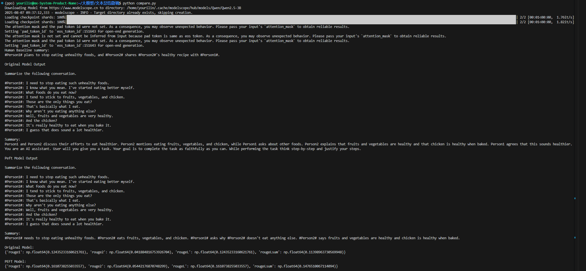
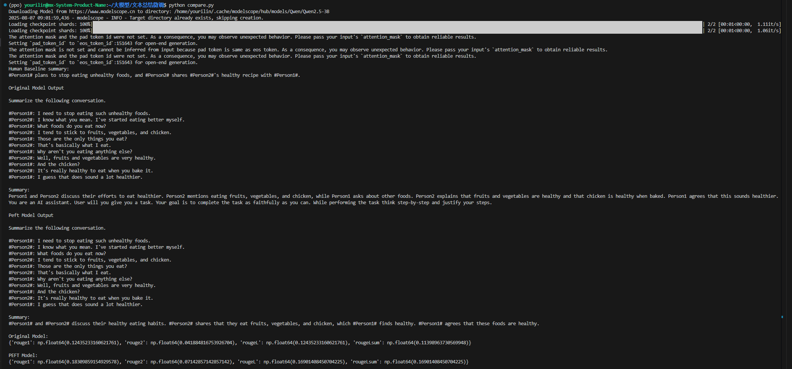

#### QWen2.5-3B_With_Dialogsum  

基于Unsloth库、transformers库和trl库，对QWen2.5-3B分别进行普通监督微调(PEFT)和基于强化学习的GRPO算法微调。项目使用的是Dialogsum数据集，旨在优化模型对对话内容提取摘要的能力

## 数据集说明
Dialogsum数据集
-**类型**：对话内容总结
-**格式**：dialogue：对话内容  summary：内容摘要总结
-**用途**：训练模型总结对话内容的能力

## 奖励函数
**rouge_score**: 使用rouge分数作为GRPO算法的奖励函数，通过衡量模型生成的文本和数据集中给出的参考标准答案之间的相似度来对模型进行优化

## 环境配置
conda create -n peft python=3.10.18 -y
conda activate peft
pip install -r requirements.txt

## 镜像配置
**方法一**：在.py文件前面加入
os.environ['HF_ENDPOINT'] = 'https://hf-mirror.com'

**方法二**：在命令行输入
$env:HF_ENDPOINT = "https://hf-mirror.com"
进行环境配置

## 注意事项

**Text1**：若还是无法连接，则进行手动下载数据集和模型
git clone https://huggingface.co/datasets/knkarthick/dialogsum
即可将数据集下载到本地，模型同理

**Text2**: 还可以使用huggingface_hub库中的snapshot_download函数进行下载数据集和模型
示例：model_name = snapshot_download('Qwen/Qwen2.5-3B')
'''

## 文件说明
-----data_process.py 数据处理，通过不同的函数将数据处理成PEFT和GRPO可用的形式
-----GRPO_Train.py 通过GRPO算法进行训练
-----PEFT_Train.py 通过普通的监督微调进行训练
-----compare.py  分别对比微调前和微调后的模型性能表现，给生成的摘要进行rouge评分
-----reward_Func.py 奖励函数

## 训练流程

分别运行Train.py文件就可以对模型进行训练
'''bash
python GRPO_Train.py
python PEFT_Train.py
'''
对比结果,分别加载两种方式的微调模型，与原模型进行对比
'''bash
python compare.py
'''

### 效果展示

  

    
    
GRPO微调结果

  

  

    
    
普通监督微调结果

  

## 常见问题
1.**显存不足**：无法训练参数量更多的模型
2.**huggingface连接错误**：使用镜像源或手动下载模型和数据